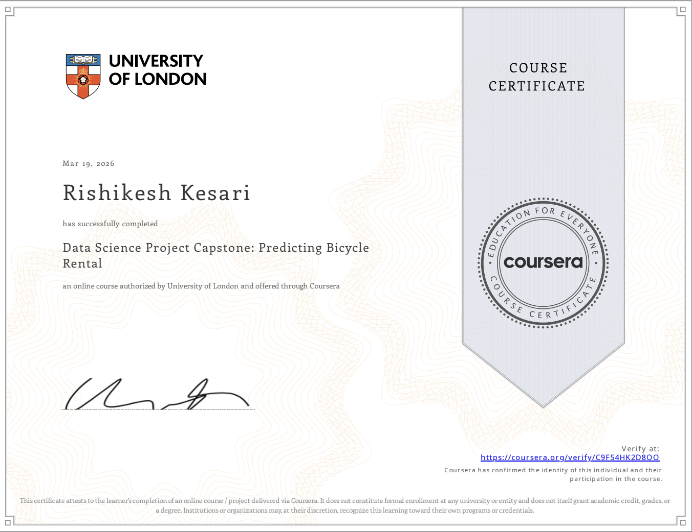
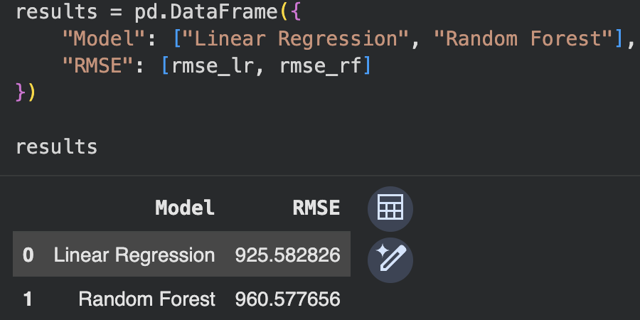
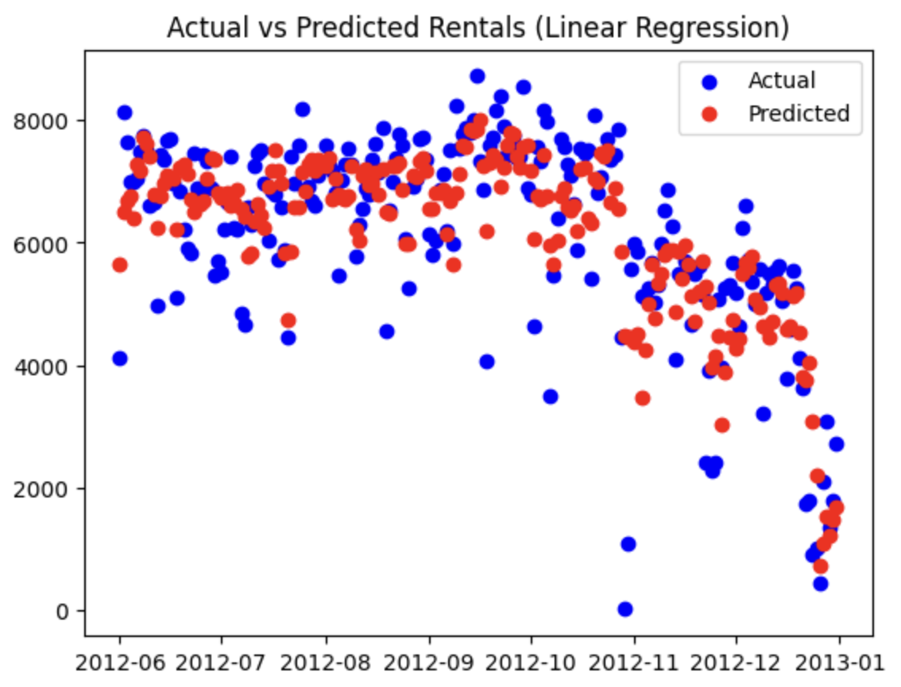
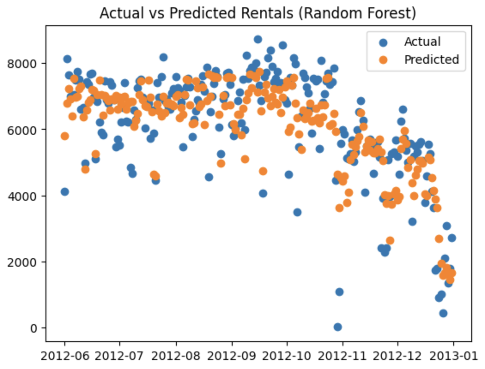

# Predicting Bicycle Rental Demand

## Overview
This project predicts daily bicycle rental demand using environmental and temporal features. The objective is to understand key drivers of rental patterns and build a regression and random forest model for demand estimation.

## Dataset
The dataset contains daily bike rental records with features such as temperature, humidity, windspeed, weather conditions, and working day indicators.

## Methodology
A structured workflow is followed, including data preprocessing, exploratory data analysis, feature engineering, and predictive modeling. A rolling average feature is introduced to capture temporal trends.

## Models
- Linear Regression  
- Random Forest Regressor  

## Evaluation
Model performance is evaluated using Root Mean Squared Error (RMSE).

- Linear Regression RMSE: ~925  
- Random Forest RMSE: ~960

- 

  
  
  

The Linear Regression model performed better, indicating largely linear relationships in the data.

## Key Insights
- Temperature and weather conditions significantly influence rental demand  
- Temporal features improve prediction accuracy  
- Linear models perform well on structured tabular data  

## Tools
Python, Pandas, NumPy, Matplotlib, Scikit-learn  

## Certification
Based on the Coursera *Data Science Project Capstone: Predicting Bicycle Rental* by the University of London, with an independently structured implementation.

## Miscellaneous
Notebook: View project python notebook [here](https://colab.research.google.com/drive/1_NVpzi02B2KC0WXXJWJ7eIPaBySai4TR)

University of London Course Certificate: Verify certificate [here](https://coursera.org/verify/C9F54HK2D800)
